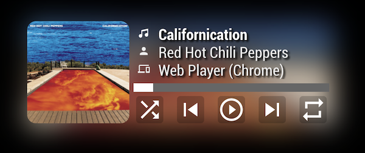

# MMM-Spotify
Spotify controller for MagicMirror

## Screenshot
- 
- 

## Main Features
- Showing Current playback on any devices
- Playing Controllable by Notification & touch (Play, pause, next, previous, volume)
- Spotify Controllable by Notification (change device, search and play)

## New updates
### 1.1.0 (2019-03-25)
- Added: touch(click) interface
- Device Limitation : Now you can allow or limit devices to display its playing on MM.
- Some CSS structure is changed.
- Now this module can emit `SPOTIFY_*` notifications for other module.
- How to update from older version
```sh
cd ~/MagicMirror/modules/MMM-Spotify
git pull
```


## Install
### 1. module install
```sh
cd ~/MagicMirror/modules
git clone https://github.com/eouia/MMM-Spotify
cd MMM-Spotify
npm install
```

### 2. Setup Spotify
- You should be a premium member of Spotify
1. Go to https://developer.spotify.com
2. Navigate to **DASHBOARD** > **Create an app** (fill information as your thought)
3. Setup the app created, (**EDIT SETTINGS**)
   - Redirect URIs. : `http://localhost:8888/callback`
   - That's all you need. Just save it.
4. Now copy your **Client ID** and **Client Secret** to any memo

### 3. Setup your module.
```sh
cd ~/MagicMirror/modules/MMM-Spotify
cp spotify.config.json.example spotify.config.json
nano spotify.config.json
```
Or any editor as your wish be ok. Open the `spotify.config.json` then modify it. You need to just fill `CLIENT_ID` and `CLIENT_SECRET`. Then, save it.
```json
{
  "CLIENT_ID" : "YOUR_CLIENT_ID",
  "CLIENT_SECRET" : "YOUR_CLIENT_SECRET",
  "AUTH_DOMAIN" : "http://localhost",
  "AUTH_PATH" : "/callback",
  "AUTH_PORT" : "8888",
  "SCOPE" : "user-read-private playlist-read-private streaming user-read-playback-state user-modify-playback-state",
  "TOKEN" : "./token.json"
}
```

### 4. Get Auth
```sh
cd ~/MagicMirror/modules/MMM-Spotify
node first_auth.js
```
Then, Allowance dialog popup will be opened. Log in(if it is needed) and allow it.
That's all. `token.json` will be created, if success.


## Configuration
### Simple
```js
{
  module: "MMM-Spotify",
  position: "bottom_left",
  config: {

  }
}
```

### Detail & Default
```js
{
  module: "MMM-Spotify",
  position: "bottom_left",
  config: {
    style: "default", // "default" or "mini" available
    updateInterval: 1000,
    onStart: null, // disable onStart feature with `null`
    allowDevices: [], //If you want to limit devices to display info, use this.
    // allowDevices: ["RASPOTIFY", "My iPhoneX", "My Home speaker"],
  }
}
```

### `onStart` feature
You can control Spotify on start of MagicMirror (By example; Autoplay specific playlist when MM starts)
```js
  onStart: {
    deviceName: "RASPOTIFY", //if null, current(last) activated device will be.
    spotifyUri: "spotify:track:3ENXjRhFPkH8YSH3qBXTfQ"
    //when search is set, sportifyUri will be ignored.
    search: {
      type: "playlist", // `artist`, track`, `album`, `playlist` and its combination(`artist,playlist,album`) be available
      keyword: "death metal",
      random:true,
    }
  }
```
When `search` field exists, `spotifyUri` will be ignored.


## Control with notification
- `SPOTIFY_SEARCH` : search items with query and play it. `type`, `query`, `random` be payloads
```
  this.sendNotification("SPOTIFY_SEARCH", {type:"artist,playlist", query:"michael+jackson", random:false})
```
- `SPOTIFY_PLAY` : playing specific SpotifyUri.
```
  this.sendNotification("SPOTIFY_PLAY", "spotify:track:3ENXjRhFPkH8YSH3qBXTfQ")
```
The SPOTIFY_PLAY notification can also be used as `resume` feature of stopped/paused player, when used without payloads
- `SPOTIFY_PAUSE` : pausing current playback.
```
  this.sendNotification("SPOTIFY_PAUSE")
```
- `SPOTIFY_NEXT` : next track of current playback.
```
  this.sendNotification("SPOTIFY_NEXT")
```
- `SPOTIFY_PREVIOUS` : previous track of current playback.
```
  this.sendNotification("SPOTIFY_PREVIOUS")
```
- `SPOTIFY_VOLUME` : setting volume of current playback. payload will be volume (0 - 100)
```
  this.sendNotification("SPOTIFY_VOLUME", 50)
```

- `SPOTIFY_TRANSFER` : change device of playing with device name (e.g: RASPOTIFY)
```
  this.sendNotification("SPOTIFY_TRANSFER", "RASPOTIFY")
```

## Usage & Tip
See the [wiki](https://github.com/eouia/MMM-Spotify/wiki)

## Credit
Special thanks to @ejay-ibm so much for taking the time to cowork to make this module.
