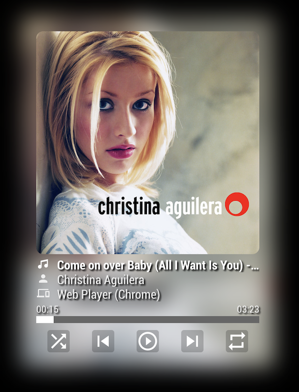

# MMM-Spotify
Spotify controller for MagicMirror. Multiples accounts supported!

## Screenshot
- 
- 

## Main Features
- Showing Current playback on any devices
- Playing Controllable by Notification & touch (Play, pause, next, previous, volume)
- Spotify Controllable by Notification (change device, search and play)
- Multiple accounts supported

## New updates

Thanks @eouia for all the hard work you put in for the MagicMirror community

### 1.3.1 (2020-05-XX)
- Modifed: 'progress bar'

### 1.3.0 (2020-05-13) **Owner Change**
- Fixed: on lost internet connexion
- Added: `SPOTIFY_CONNECTED` `SPOTIFY_DISCONNECTED` notification
- Added: `debug` mode
- Added: `deviceDisplay` feature
- Added: handling for extra device icons
- Added: debug mode for Hiding console logs (memory leaks)
- Added: fade in transition on cover
- Added: box shadow around cover to highlight from background

## Install
### 1. module install
```sh
cd ~/MagicMirror/modules
git clone https://github.com/eouia/MMM-Spotify
cd MMM-Spotify
npm install
```

### 2. Setup Spotify
- You should be a premium member of Spotify
1. Go to https://developer.spotify.com
2. Navigate to **DASHBOARD** > **Create an app** (fill information as your thought)
3. Setup the app created, (**EDIT SETTINGS**)
   - Redirect URIs. : `http://localhost:8888/callback`
   - That's all you need. Just save it.
4. Now copy your **Client ID** and **Client Secret** to any memo

### 3. Setup your module.
```sh
cd ~/MagicMirror/modules/MMM-Spotify
cp spotify.config.json.example spotify.config.json
nano spotify.config.json
```
Or any editor as your wish be ok. Open the `spotify.config.json` then modify it. You can create a configuration object for each account you need to use. You need to just fill `CLIENT_ID` and `CLIENT_SECRET` for each of them. Then, save it.
```json
[
  {
      "USERNAME": "USERNAME",
      "CLIENT_ID" : "YOUR_CLIENT_ID",
      "CLIENT_SECRET" : "YOUR_CLIENT_SECRET",
      "AUTH_DOMAIN" : "http://localhost",
      "AUTH_PATH" : "/callback",
      "AUTH_PORT" : "8888",
      "SCOPE" : "user-read-private playlist-read-private streaming user-read-playback-state user-modify-playback-state",
      "TOKEN" : "./token.json"
  }
]
```

### 4. Get Auth
```sh
cd ~/MagicMirror/modules/MMM-Spotify
node first_auth.js
```
Then, Allowance dialog popup will be opened. You MUST LOG IN IN SAME ORDER YOU PUT YOUR USERS IN CONFIGURATION FILE. Log in(if it is needed) and allow it.
That's all. `token.json` will be created, if success.

## Configuration
### Simple
```js
{
  module: "MMM-Spotify",
  position: "bottom_left",
  config: {

  }
}
```

### Detail & Default
```js
{
  module: "MMM-Spotify",
  position: "bottom_left",
  config: {
    debug: false, // debug mode
    style: "default", // "default" or "mini" available
    control: "default", //"default", "hidden" available
    updateInterval: 1000,
    onStart: null, // disable onStart feature with `null`
    deviceDisplay: "Listening on", // text to display in the device block (default style only)
    allowDevices: [], //If you want to limit devices to display info, use this.
    // allowDevices: ["RASPOTIFY", "My iPhoneX", "My Home speaker"],
  }
}
```

### `onStart` feature
You can control Spotify on start of MagicMirror (By example; Autoplay specific playlist when MM starts)
```js
  onStart: {
    deviceName: "RASPOTIFY", //if null, current(last) activated device will be.
    spotifyUri: "spotify:track:3ENXjRhFPkH8YSH3qBXTfQ"
    //when search is set, sportifyUri will be ignored.
    search: {
      type: "playlist", // `artist`, track`, `album`, `playlist` and its combination(`artist,playlist,album`) be available
      keyword: "death metal",
      random:true,
    }
  }
```
When `search` field exists, `spotifyUri` will be ignored.


## Control with notification
- `SPOTIFY_SEARCH` : search items with query and play it. `type`, `query`, `random` be payloads
```
  this.sendNotification("SPOTIFY_SEARCH", {type:"artist,playlist", query:"michael+jackson", random:false})
```
- `SPOTIFY_PLAY` : playing specific SpotifyUri. There could be two types of uri - `context_uri` and `uris`. 
    - `context_uri:String` : Spotify URI of the context to play. Valid contexts are albums, artists, playlists.
    - `uris:[]`: A JSON array of the Spotify track URIs to play
```
   this.sendNotification("SPOTIFY_PLAY", {"context_uri": "spotify:album:1Je1IMUlBXcx1Fz0WE7oPT"})
//OR
   this.sendNotification("SPOTIFY_PLAY", {
     "uris": ["spotify:track:4iV5W9uYEdYUVa79Axb7Rh", "spotify:track:1301WleyT98MSxVHPZCA6M"]
   })
```
The SPOTIFY_PLAY notification can also be used as `resume` feature of stopped/paused player, when used without payloads
- `SPOTIFY_PAUSE` : pausing current playback.
```
  this.sendNotification("SPOTIFY_PAUSE")
```
- `SPOTIFY_TOGGLE` : toggling for playing/pausing
```
  this.sendNotification("SPOTIFY_TOGGLE")
```
- `SPOTIFY_NEXT` : next track of current playback.
```
  this.sendNotification("SPOTIFY_NEXT")
```
- `SPOTIFY_PREVIOUS` : previous track of current playback.
```
  this.sendNotification("SPOTIFY_PREVIOUS")
```
- `SPOTIFY_VOLUME` : setting volume of current playback. payload will be volume (0 - 100)
```
  this.sendNotification("SPOTIFY_VOLUME", 50)
```

- `SPOTIFY_TRANSFER` : change device of playing with device name (e.g: RASPOTIFY)
```
  this.sendNotification("SPOTIFY_TRANSFER", "RASPOTIFY")
```
- `SPOTIFY_SHUFFLE` : toggle shuffle mode.
```
  this.sendNotification("SPOTIFY_SHUFFLE")
```
- `SPOTIFY_REPEAT` : change repeat mode. (`off` -> `track` -> `context`)
```
this.sendNotification("SPOTIFY_REPEAT")
```

## Notification send

- `SPOTIFY_CONNECTED`: Spotify is connected to a device
- `SPOTIFY_DISCONNECTED`: Spotify is disconnected

It can be used with MMM-pages for example (for show or hide the module)

## Usage & Tip
See the [wiki](https://github.com/eouia/MMM-Spotify/wiki)

## Update History

### 1.2.1 (2020-02-27)
- Fixed: Using old configuration error.

### 1.2 (2020-02-20)
- Added : `MULTIPLE ACCOUNTS`

- How to update from older version
```sh
cd ~/MagicMirror/modules/MMM-Spotify
git pull
npm install
```

### 1.1.2 (2019-05-06)
- Added : `SPOTIFY_TOGGLE` notification for toggling Play/Pause

### 1.1.1 (2019-04-11)
- Added : CSS variable for easy adjusting size. (Adjust only --sp-width to resize)
- Added : Hiding module when current playback device is inactivated. (More test might be needed, but...)

### 1.1.0 (2019-03-25)
- Added: touch(click) interface
- Device Limitation : Now you can allow or limit devices to display its playing on MM.
- Some CSS structure is changed.
- Now this module can emit `SPOTIFY_*` notifications for other module.

## Credit
- Special thanks to @ejay-ibm so much for taking the time to cowork to make this module.
- Thanks to @KamisamaPT for helping design
